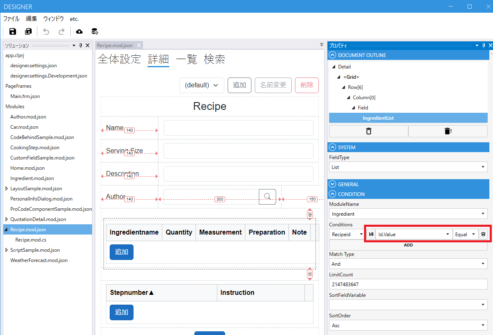

# デザイナ
ローコード実行エンジンで動作する画面、機能を作成していきます。
作成するデータは json ファイルと cs ファイルなので git などのバージョン管理ツールで管理することが可能です。
以下をそれぞれ編集できます。

## 編集
- [Module](module.md)
- [PageFrame](page_frame.md)
- [designer.settings](designer_settings.md)
- [app.clprj](app_clprj.md)

## レイアウトに関して
Desingerでは画面をポトペタで非常に簡単に設定できます。

[レイアウト](layout.md)

## デザイナのカスタマイズ
デザイナもCodeer.LowCode.Blazor.Desingerを参照するWPFアプリです。ProCodeでカスタマイズ可能部分があります。

[カスタマイズ](designer-customize.md)

## デザイナ上の検索コンポーネントの実装
デザイナでListField、LinkField、SelectFieldの検索条件で条件を設定可能なフィールドであればGUI上で条件を設定できます。ProCodeでカスタムのFieldを作った場合にそのFieldの持つ値を条件に設定可能にする場合はこれを実装する必要があります。

[検索コンポーネントの実装](designer-match-customize.md.md)

