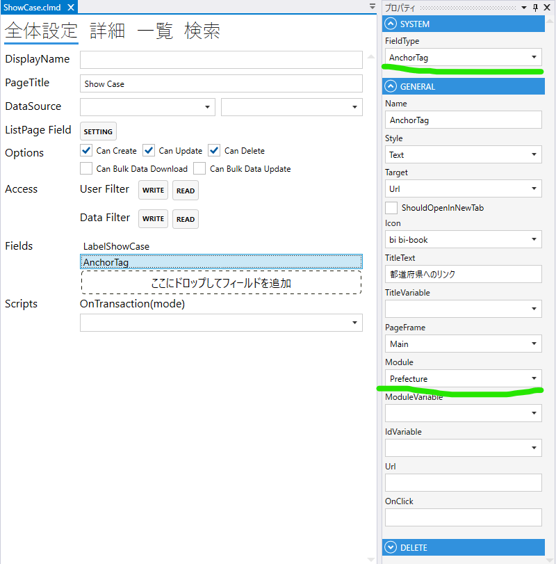
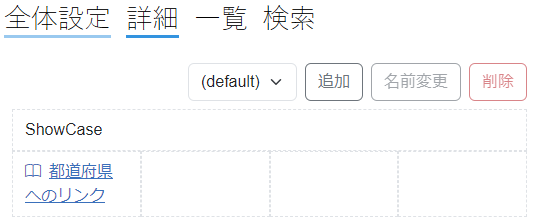

# AnchorTag

1. FieldType
  - AnchorTagを設定する
2. Style
  - Text
    - テキストのリンクを作成する
    - ボタンのリンクを作成する
3. Target
  - Url
  - HistoryBack
    - 戻るリンク
  - HistoryForward
    - 進むリンク
4. Icon
  - アイコンを表示する
5. TitleText
  - リンクの文字列
6. TitleVariable
   - TBD
7. PageFrame
8. Module
  - リンク先のModuleを指定する
9. IdVariable
10. Url
11. OnClick
  - OnClick 時の動作を設定する
 

## スクリプト
| プロパティ名          | 型               | 説明                                            |
|-----------------|-----------------|-----------------------------------------------|
| BackgroundColor | string?         | Fieldの背景色                                     | 
| Color           | string?         | Fieldの色                                       |
| IsEnabled       | bool            | Fieldの有効/無効                                   |
| IsVisible       | bool            | Fieldの表示/非表示                                  |
| IsViewOnly      | bool            | Fieldの編集可/編集不可                                |

| メソッド名      | 戻り値     | 説明        |
|------------|---------|-----------|
| GetTitle() | string  | タイトルを取得する |
| GetUrl()   | string  | URLを取得する  |
