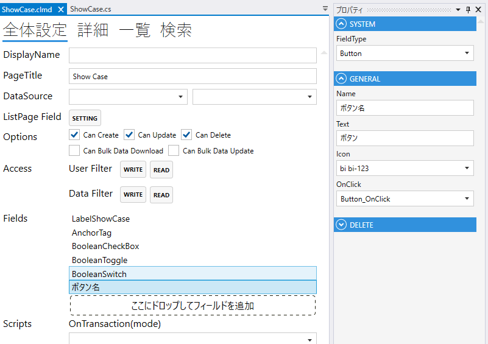
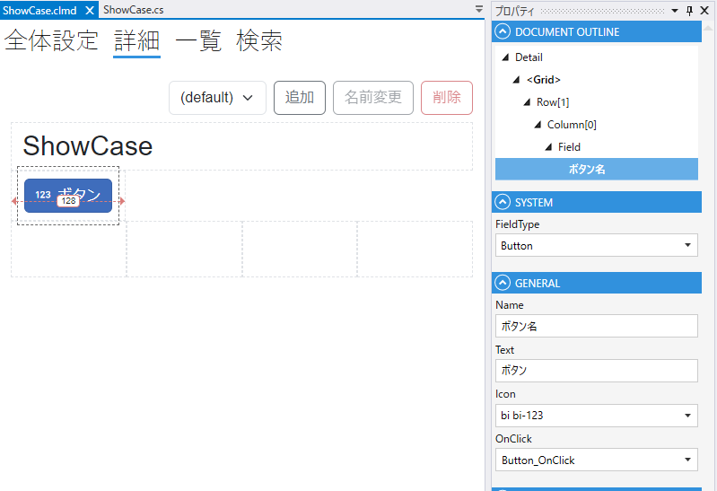

# Button

1. FieldType
   - Buttonを設定する
2. Name
    - フィールド名の設定. 全体設定時に表示される.
3. Text
    - 表示テキスト
4. Icon
    - アイコンを設定
5. OnClick
    - OnClick 時の動作を設定する

## スクリプト
| プロパティ名          | 型       | 説明             |
|-----------------|---------|----------------|
| BackgroundColor | string? | Fieldの背景色      | 
| Color           | string? | Fieldの色        |
| IsEnabled       | bool    | Fieldの有効/無効    |
| IsVisible       | bool    | Fieldの表示/非表示   |
| IsViewOnly      | bool    | Fieldの編集可/編集不可 |
| IsModified      | bool    | Fieldが変更されたどうか |
