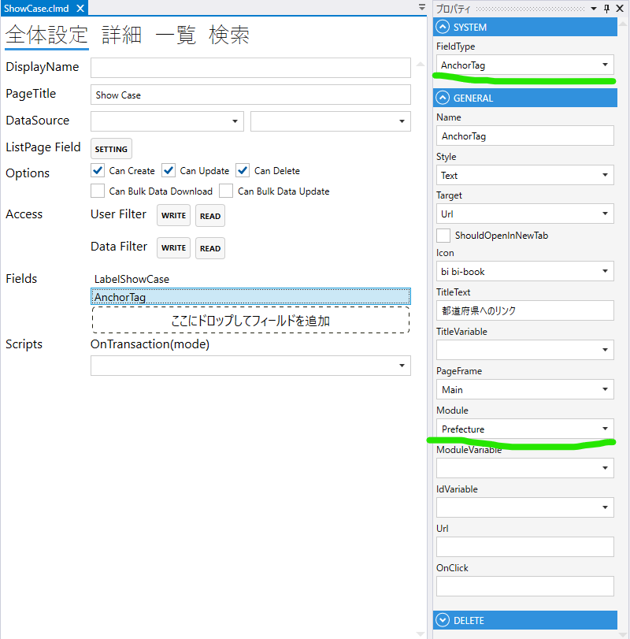
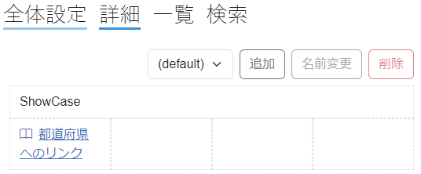

# AnchorTag

1. FieldType
  - AnchorTagを設定する
2. Style
  - Text
    - テキストのリンクを作成する
    - ボタンのリンクを作成する
3. Target
  - Url
  - HistoryBack
    - 戻るリンク
  - HistoryForward
    - 進むリンク
4. Icon
  - アイコンを表示する
5. TitleText
  - リンクの文字列
6. TitleVariable
   - TBD
7. PageFrame
8. Module
  - リンク先のModuleを指定する
9. IdVariable
10. Url
11. OnClick
  - OnClick 時の動作を設定する
 

