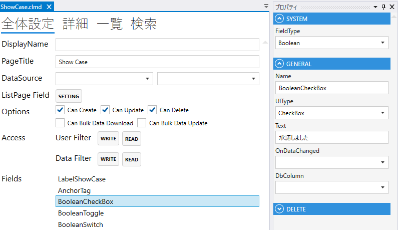
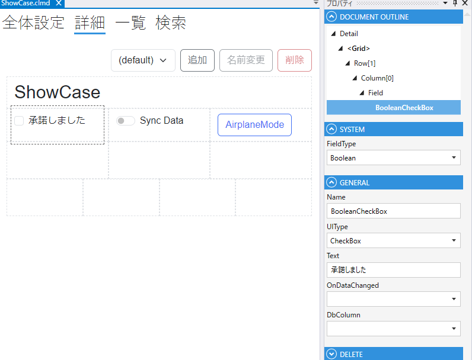

# Boolean

1. FieldType
- Booleanを設定する
2. Name
    - フィールド名
3. UIType
   - CheckBox
   - Switch
   - Toggle
4. Text
   - 表示テキスト
5. OnDataChanged
   - 変更時のスクリプト
6. DbColumn
   - OnClick 時の動作を設定する

## スクリプト
| プロパティ名          | 説明                                               |
|-----------------|--------------------------------------------------|
| Value           | Fieldの値                                          |
| SearchValue     | 一覧の検索条件のinputフィールドのvalue                         |
| Color           | Fieldの色                                          |
| BackgroundColor | Fieldの背景色                                        | 
| IsEnabled       | Fieldの有効/無効                                      |
| IsVisible       | Fieldの表示/非表示                                     |
| IsViewOnly      | Fieldの編集可/編集不可                                   |
| IsModified      | Fieldが変更されたどうか                                   |
