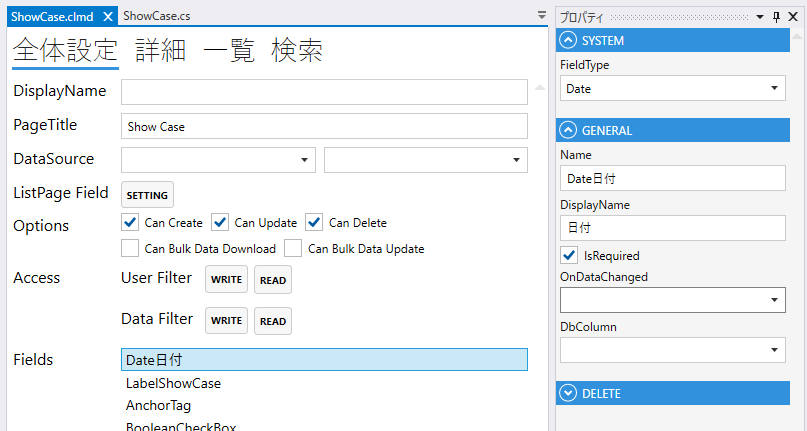
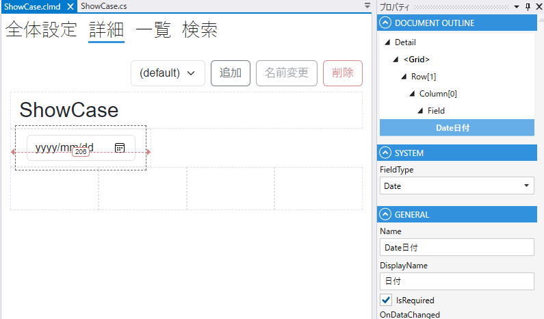

# Date

1. FieldType
    - Dateを設定する
2. Name
    - フィールド名の設定. 全体設定時に表示される.
3. DisplayName
    - TBD
4. IsRequired
    - 登録時，必須にする
5. DbColumn
    - テーブルのカラムの設定

## スクリプト
| プロパティ名          | 説明             |
|-----------------|----------------|
| Value           | Fieldの値        |
| Color           | Fieldの色        |
| BackgroundColor | Fieldの背景色      | 
| IsEnabled       | Fieldの有効/無効    |
| IsVisible       | Fieldの表示/非表示   |
| IsViewOnly      | Fieldの編集可/編集不可 |
| IsModified      | Fieldが変更されたどうか |
| SearchMax       | 一覧の検索条件の日付の最大値 |
| SearchMin       | 一覧の検索条件の日付の最小値 |

