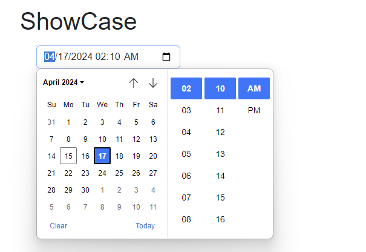
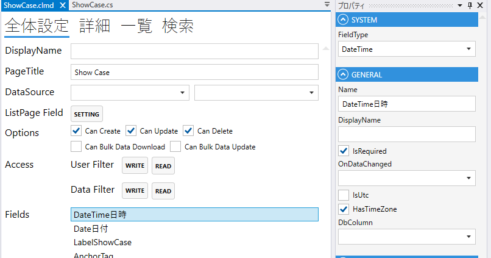
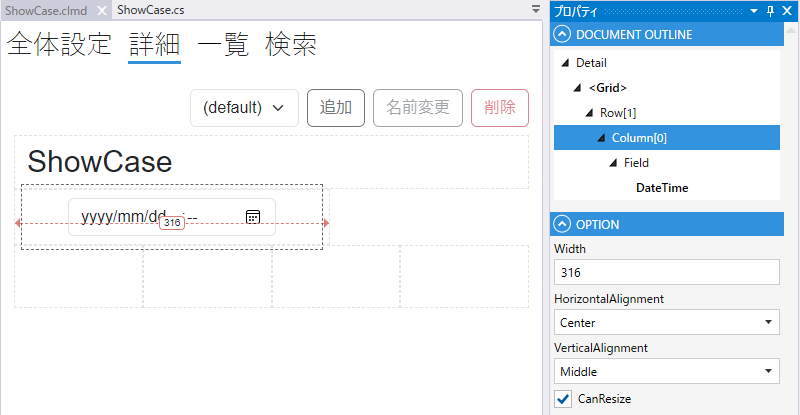

# DateTime

1. FieldType
    - DateTimeを設定する
2. Name
    - フィールド名の設定. 全体設定時に表示される.
3. DisplayDane
    - TBD
4. IsRequired
    - 登録時，必須にする
5. OnDataChanged
    - 日時変更時の挙動を定義する.
6. IsUtc
    - UTCでDBに保存する.
7. HasTimeZone
    - TimeZone付きで保存する.
8. DbColumn
    - カラムの設定
    

