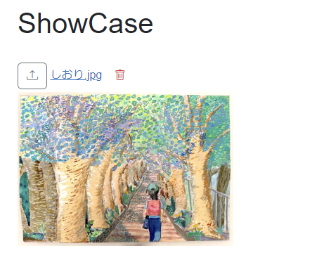
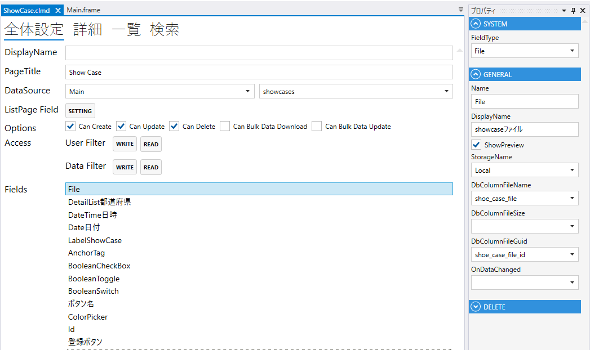
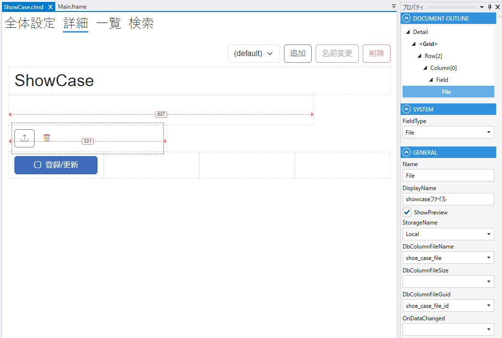

# File

Fileのアップロードを行うComponent





下記テーブルが必要
```sql
create table temporary_files
(
    id bigint generated by default as identity primary key,
    guid uuid not null,
    created_date_time timestamp
);
```
1. FieldType
    - Fileを設定する
2. Name
    - フィールド名の設定. 全体設定時に表示される.
3. DisplayDane
    - TBD
4. StorageName
      - designer.settings.jsonに設定を記載する
      ```json
      "FileStorages": 
       [
       {
        "FileStorageType": "FileSystem",
        "Name": "Local"
       }
       ]
5. DbColumnFileName
    - テーブルのカラムの設定
6. DbColumnFileSize
    - テーブルのカラムの設定
7. OnDataChanged
    - File変更時のスクリプト


