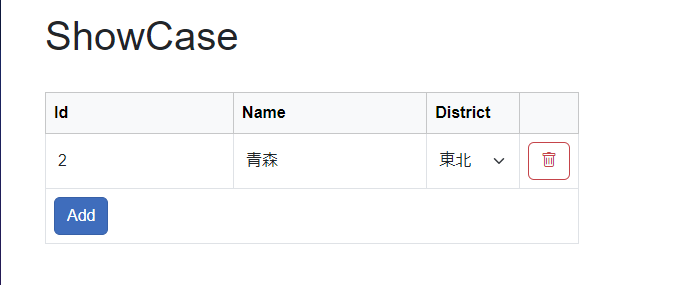
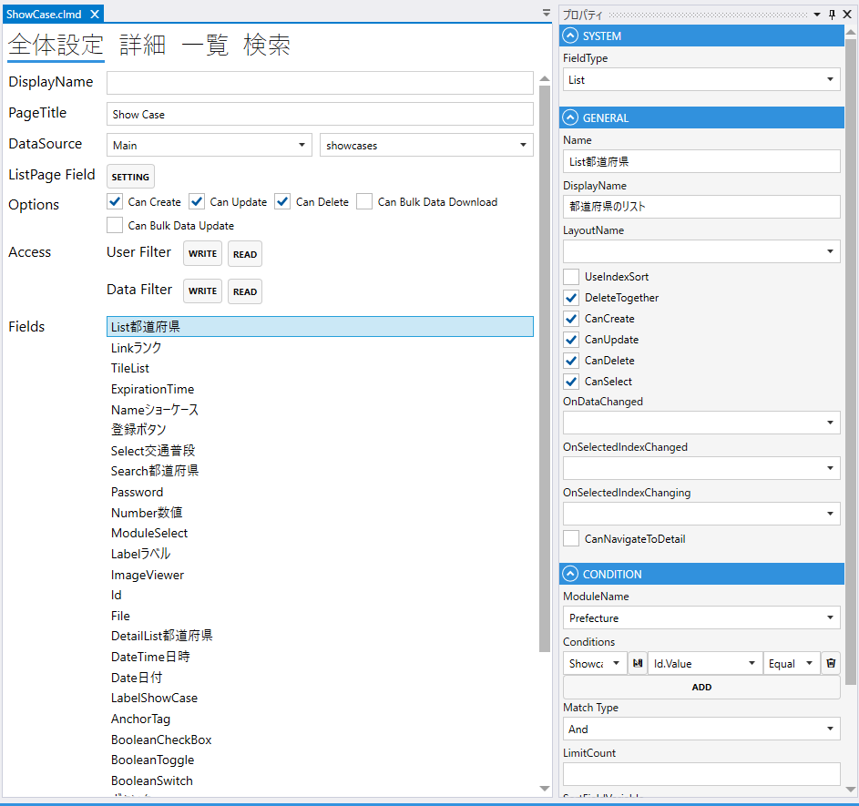
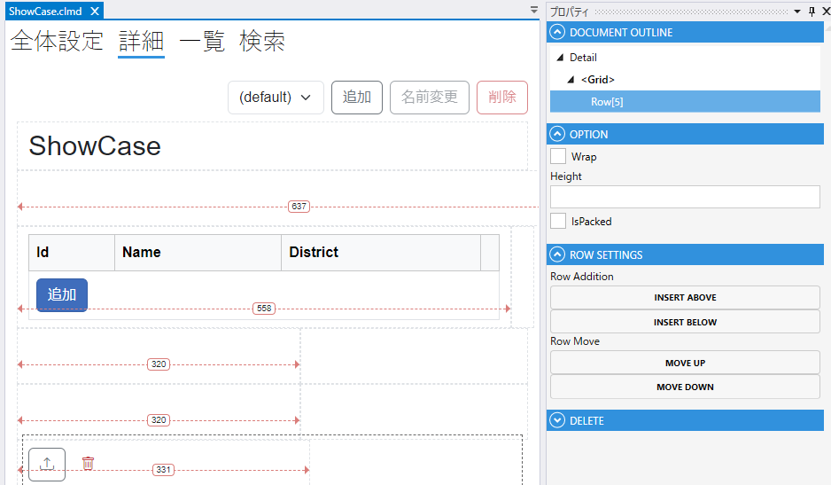

# List

Listでmoduleを表示する.

### GENERAL
1. FieldType
    - Listを設定する
2. Name
    - フィールド名の設定. 全体設定時に表示される.
3. DisplayDane
    - TBD
4. UseIndexSort
5. DeleteTogether
    - 親データの削除時に削除する
6. CanCreate
    - 親画面で作成する
7. CanUpdate
    - 親画面で更新する
8. CanDelete
    - 親画面で削除する
9. CanSelect
    - 親画面で選択する
10. CnNavigateToDetail
    - 詳細への遷移

### CONDITION
- ModuleName
    - Moduleを指定する.
- Conditions
    - 表示する条件を指定する.
- MatchType
    - 複数の条件がある場合に，`And` or `Or` を指定する.
- LimitCount
    - 表示する上限
- SortFieldVariable
    - ソートに使用する項目
- SortOrder
    - ソート順（`Asc` or `Desc`）
      

## スクリプト
| プロパティ名              | 型       | 説明                    |
|---------------------|---------|-----------------------|
| AllowReloadLinkData | bool    | 再読み込みを許可するか           | 
| BackgroundColor     | string? | Fieldの背景色             | 
| Color               | string? | Fieldの色               |
| DisplayText         | string? | Fieldの色               |
| IsEnabled           | bool    | Fieldの有効/無効           |
| IsModified          | bool    | Fieldが変更されたどうか        |
| IsVisible           | bool    | Fieldの表示/非表示          |
| IsViewOnly          | bool    | Fieldの編集可/編集不可        |
| SearchValue         | string? | 検索条件のinputフィールドのvalue |
| Value               | string  | Fieldの値               |

