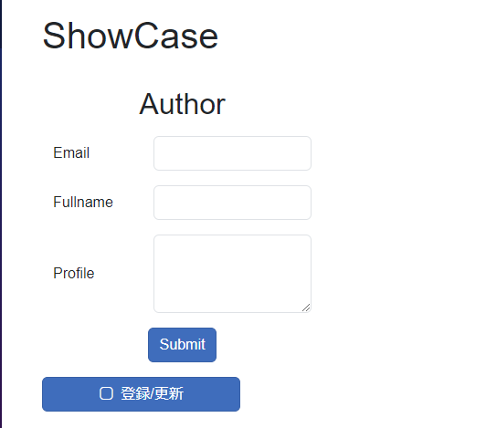
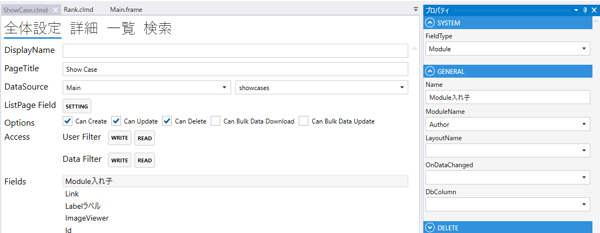
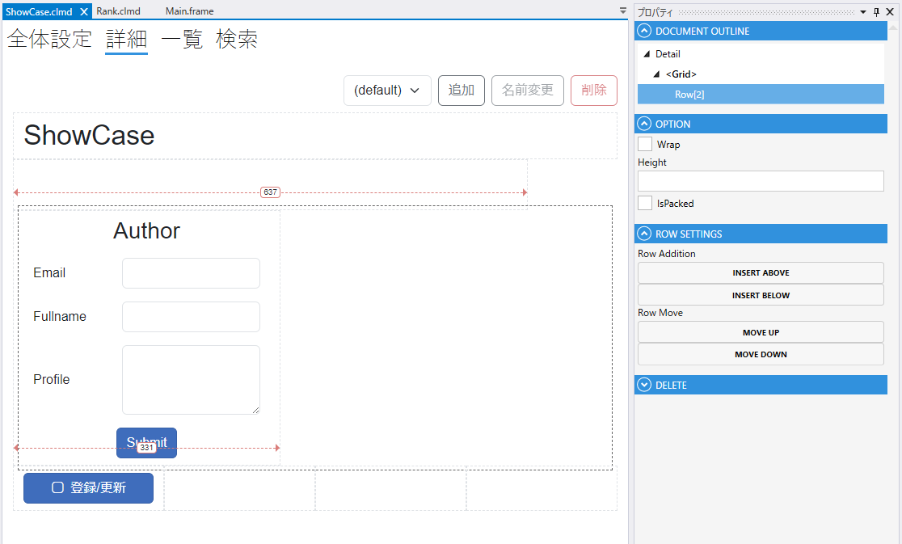

# Module

ModuleをネストするField

1. FieldType
    - Moduleを設定する
2. ModuleName
    - 入れ子にするModuleを指定する.
3. LayoutName
    - 表示するLayout(入れ子にするModuleの詳細設定で作成する)を指定する.
4. OnDataChanged
    - 変更時のスクリプト
5. DbColumn
    - テーブルのカラムの設定

