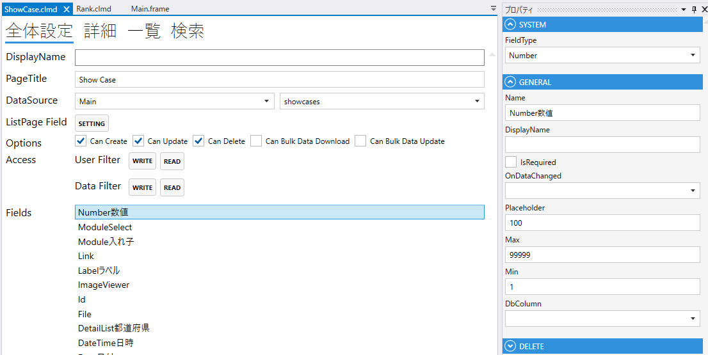
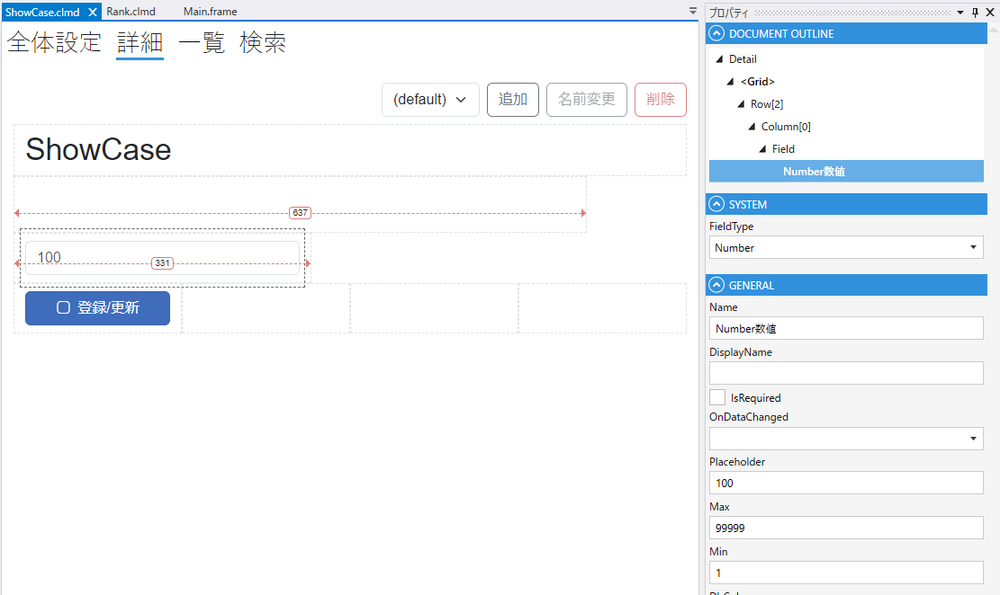

# Number

数値を表すField

1. FieldType
    - Numberを設定する
2. Name
    - フィールド名の設定. 全体設定時に表示される.
3. DisplayName
    - TBD
4. IsRequired
    - 登録時，必須にする
5. Max
    - 最大値の設定
6. Min
    - 最小値の設定
7. DbColumn
    - テーブルのカラムの設定

