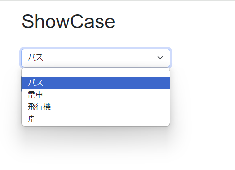
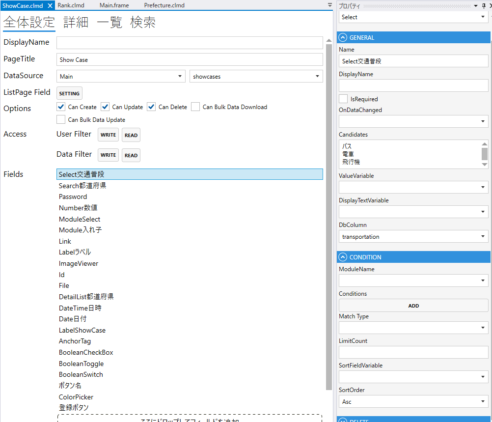
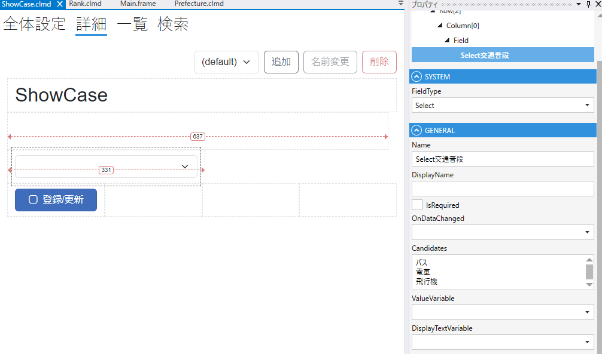

# Select

### GENERAL
1. FieldType
    - Selectを設定する
2. Name
    - フィールド名の設定. 全体設定時に表示される.
3. DisplayName
    - TBD
4. IsRequired
    - 登録時，必須にする
5. OnDataChanged
   - 変更時のスクリプト
6. Candidates
   - Selectの選択肢
7. ValueVariable
   - TBD
8. DisplayTextVariable
   - TBD
9. DbColumn
    - テーブルのカラムの設定

### CONDITION
- ModuleName
  - モジュールを選択肢にする場合に指定する.
- Conditions
  - 表示する条件を設定する
- MatchType
  - 条件の結合. `And` or `Or`
- LimitCount
  - 表示する最大
- SortFieldValue
  - ソートに使用するフィールド
- SortOrder
  - ソート順. `Asc` or `Desc`

