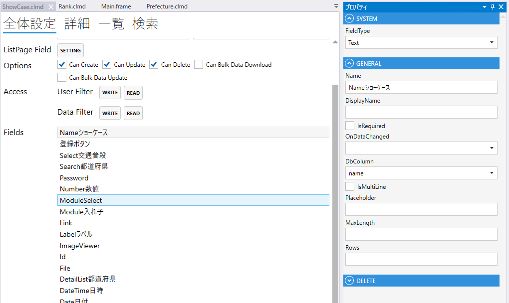
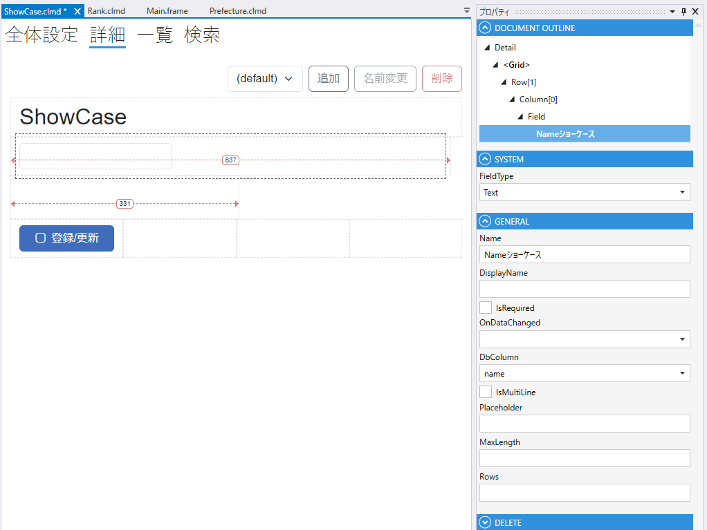

# Text

テキストを表示する

1. FieldType
    - Textを設定する
2. Name
    - フィールド名の設定. 全体設定時に表示される.
3. DisplayName
    - TBD
4. DbColumn
    - テーブルのカラムの設定
5. Placeholder
    - placeholderの設定
6. MaxLength
   - 最大文字数の設定
7. Rows
   - textareaにする場合，行数を指定する. 

