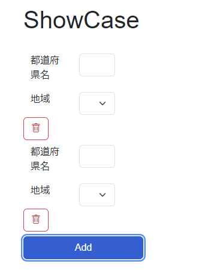
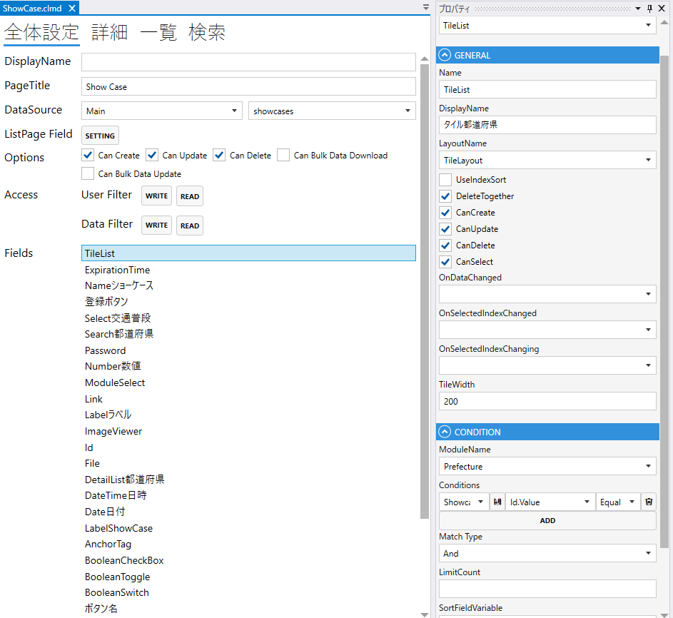
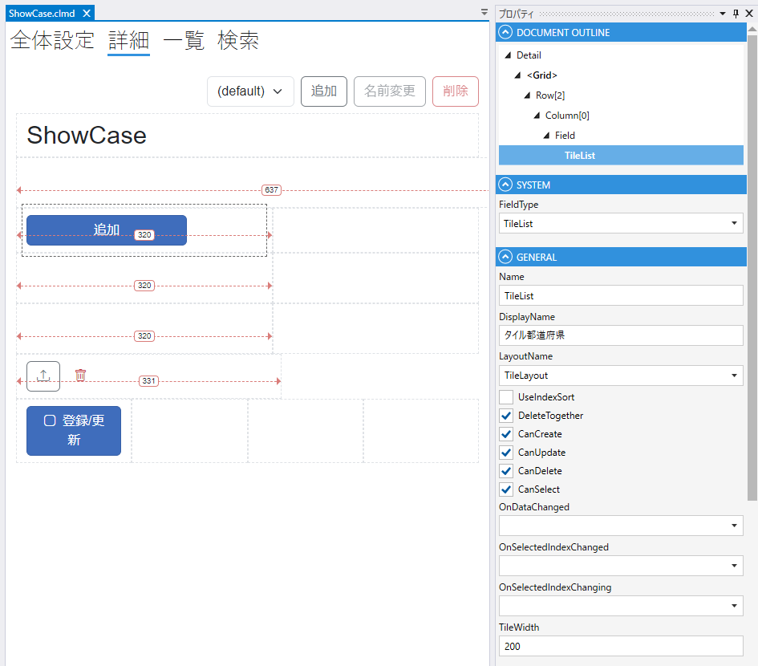

# TileList

タイル状にmoduleを表示する

### GENERAL
1. FieldType
    - TileListを設定する
2. Name
    - フィールド名の設定. 全体設定時に表示される.
3. DisplayDane
    - TBD
4. UseIndexSort
5. DeleteTogether
    - 親データの削除時に削除する
6. CanCreate
    - 親画面で作成する
7. CanUpdate
    - 親画面で更新する
8. CanDelete
    - 親画面で削除する
9. CanSelect
    - 親画面で選択する
10. OnDataChanged
    - 変更のスクリプト
11. OnSelectedIndexChanged
    - 変更のスクリプト
12. OnSelectedIndexChanging
    - 変更のスクリプト
13. TileWidth
    - タイルの幅

### CONDITION
- ModuleName
    - Moduleを指定する.
- Conditions
    - 表示する条件を指定する.
- MatchType
    - 複数の条件がある場合に，`And` or `Or` を指定する.
- LimitCount
    - 表示する上限
- SortFieldVariable
    - ソートに使用する項目
- SortOrder
    - ソート順（`Asc` or `Desc`）
      

