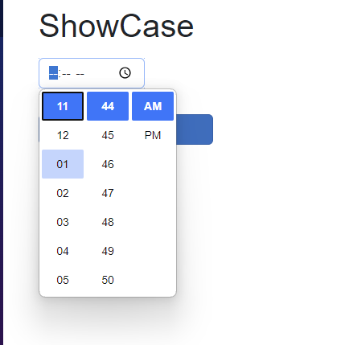
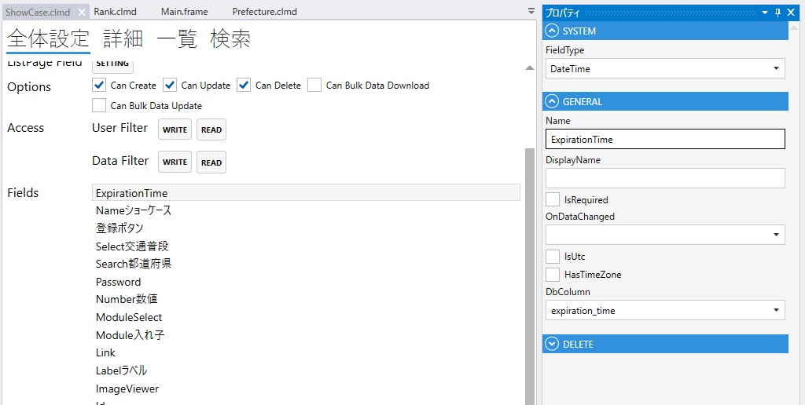
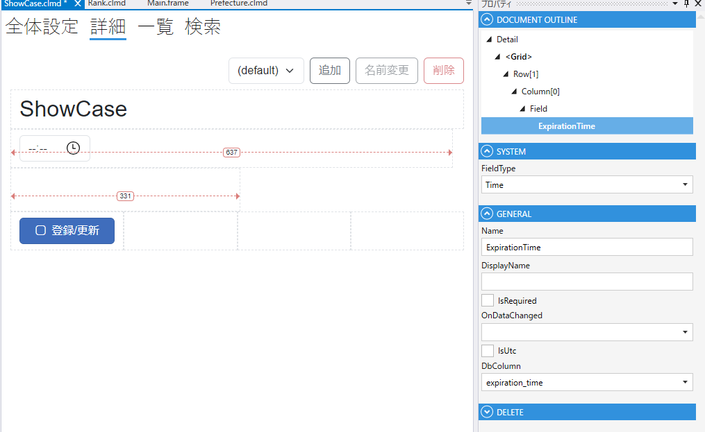

# Time

時刻を表すフィールド

1. FieldType
    - Timeを設定する
2. Name
    - フィールド名の設定. 全体設定時に表示される.
3. DisplayName
    - TBD
4. IsRequired
    - 登録時，必須にする
5. IsUtc
   - UTCかどうかを設定する.
6. HasTimeZone
    - タイムゾーン付きかどうかを設定する.
7. DbColumn
    - テーブルのカラムの設定

