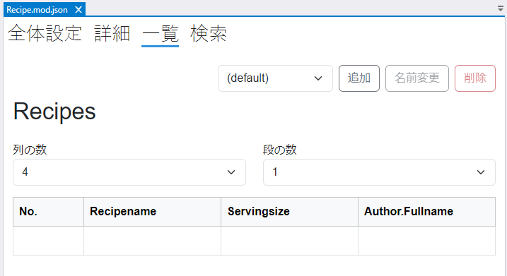
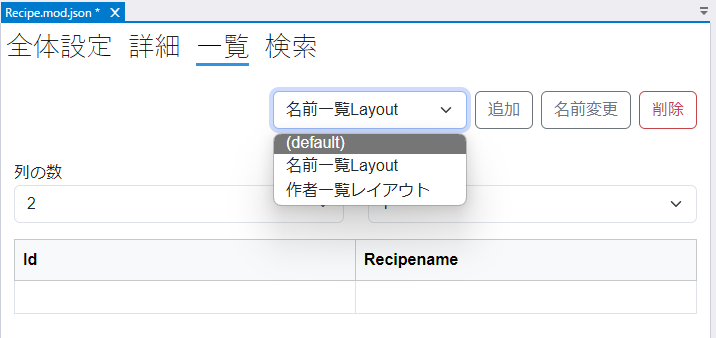
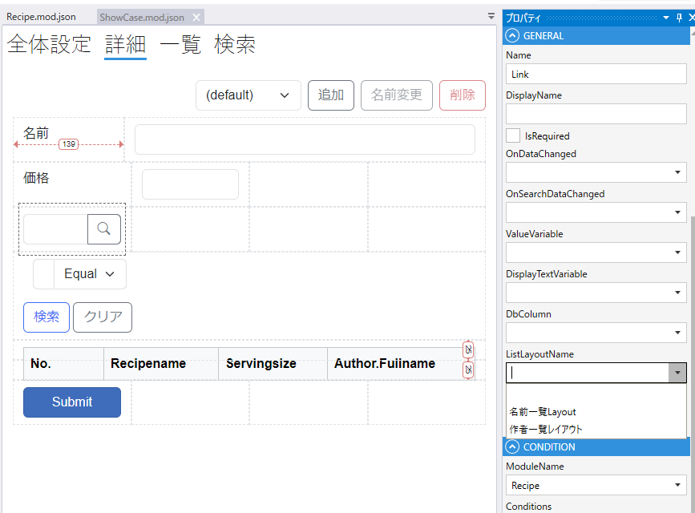

# レイアウト一覧

モジュールの一覧設定画面で一覧のレイアウトを設定します．

## デフォルトレイアウト

モジュールの一覧画面に使うレイアウト設定はdefaultという名前で作成されます．（変更できません）

モジュールの一覧ページにはdefaultのレイアウトが適用されます．

## 複数レイアウト

追加ボタンをクリックしてデフォルトとは異なるレイアウトを作成することができます．

`LinkField` にdefaultを含む作成済みのすべてのレイアウトから, 適用するレイアウトを指定できます.

