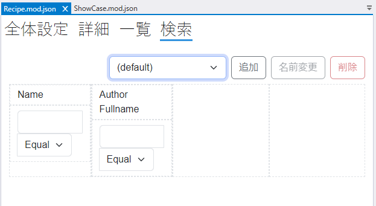
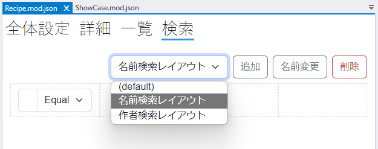
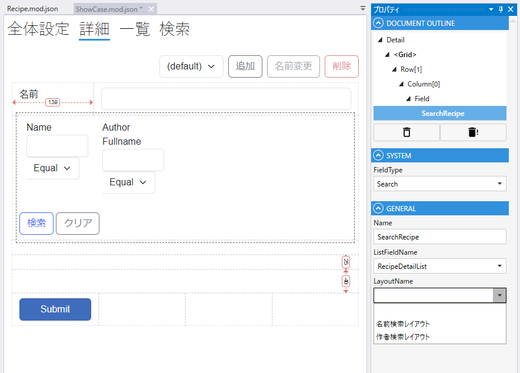

# レイアウト検索

モジュールの検索設定画面で検索のレイアウトを設定します．

## デフォルトレイアウト

モジュールの検索画面に使うレイアウト設定はdefaultという名前で作成されます．（変更できません）

モジュールの検索ページにはdefaultのレイアウトが適用されます．

## 複数レイアウト

追加ボタンをクリックしてデフォルトとは異なるレイアウトを作成することができます．

`SearchField` にdefaultを含む作成済みのすべてのレイアウトから, 適用するレイアウトを指定できます.

