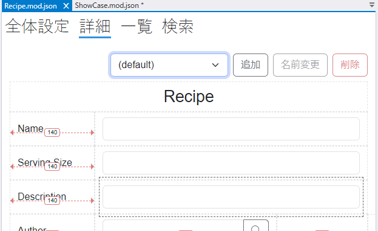
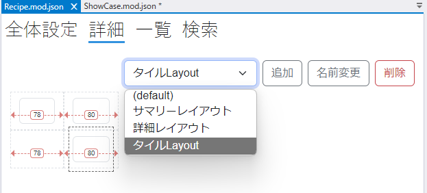
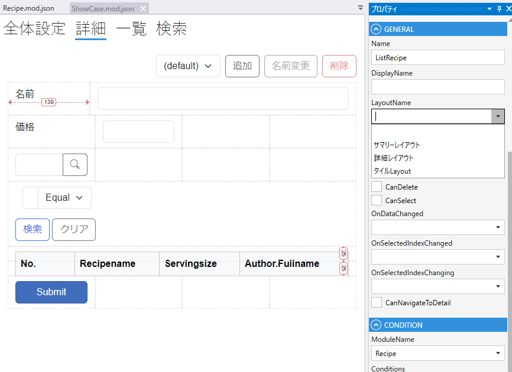

# レイアウト詳細

モジュールの詳細設定画面で詳細のレイアウトを設定します．

## デフォルトレイアウト

モジュールの詳細画面に使うレイアウト設定はdefaultという名前で作成されます．（変更できません）

モジュールの詳細ページにはdefaultのレイアウトが適用されます．

## 複数レイアウト

追加ボタンをクリックしてデフォルトとは異なるレイアウトを作成することができます．

`ListField`, `DetailList`, `TileList` にdefaultを含む作成済みのすべてのレイアウトから, 適用するレイアウトを指定できます.

