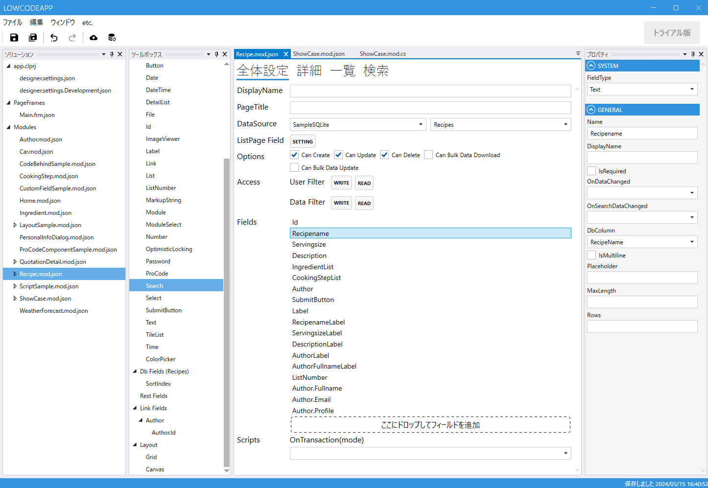

# モジュール全体設定

## ツールボックス
モジュールで使用するFieldを選択します．

| 項目           | 説明                                               |
|--------------|--------------------------------------------------|
| SystemFields | SystemFieldの一覧が表示されます                            |
| CommonFields | CommonFieldの一覧が表示されます                            |
| DB Fields    | 全体設定でDataSourceを指定した場合に，テーブルのカラムからField候補が表示されます |
| Rest Fields  | DB Fieldsで詳細設定で（まだ）使用していないFieldが表示されます．          |
| Link Fields  | Linkフィールドを作成した場合に，Link先のフィールドが表示されます.            |
| Layout       | 詳細画面でGridレイアウト，Canvasレイアウトを設定時に使用します．            |

## 設定項目
| 項目            | 説明                                                                                              |
|---------------|-------------------------------------------------------------------------------------------------|
| DisplayName   | 表示名です。現在はModuleSelectFieldで表示するときだけに使われています                                                     |
| PageTitle     | htmlのタイトルに設定されます                                                                                |
| DataSource    | DBとテーブルを指定することによりEntityとして設定します. DataSourceは[designer.settings](../designer_settings.md)で設定 |
| ListPageField | 一覧ページでのリスト設定です                                                                                  |
| Option        | `作成`, `更新`, `削除`, `一括ダウンロード`, `一括更新` の有無を設定します                                                  |
| Access        | - ユーザーとデータ内容によるアクセス制御を設定します                                                                     |
| Fields        | Module内で使用するFieldをToolBoxから定義します                                                                |
| Scripts       | Scriptを定義します                                                                                    |

## プロパティ
選択しているFieldのプロパティが表示されます
