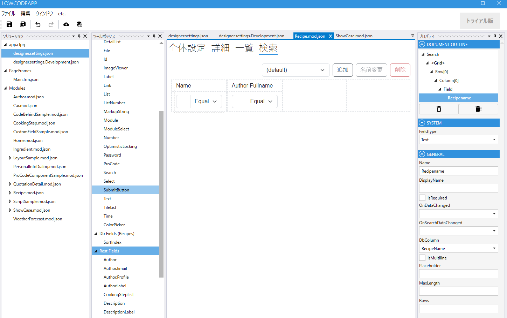
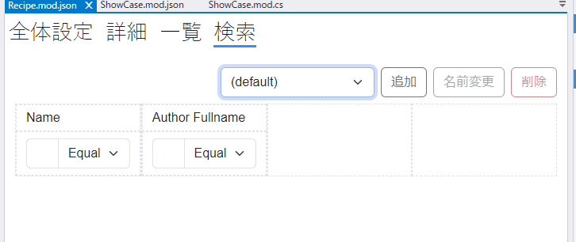
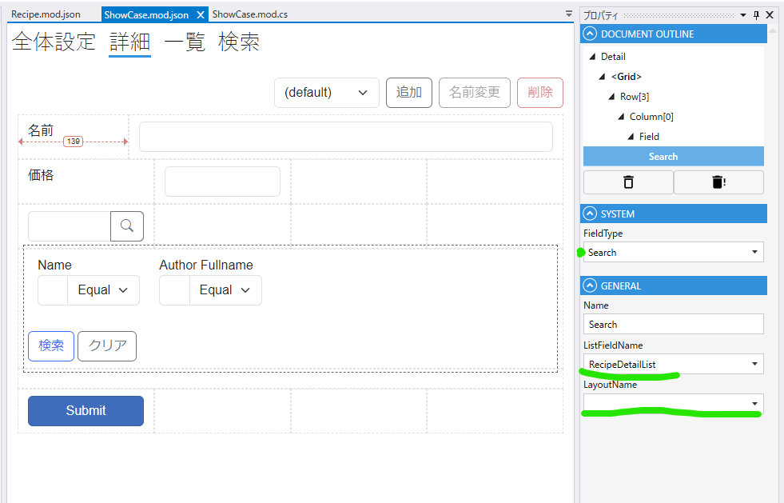
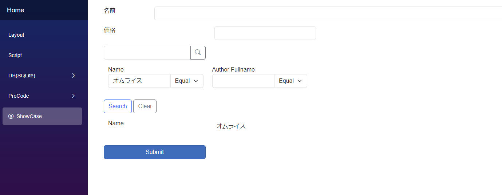
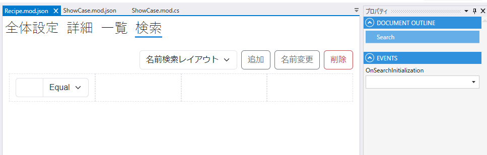
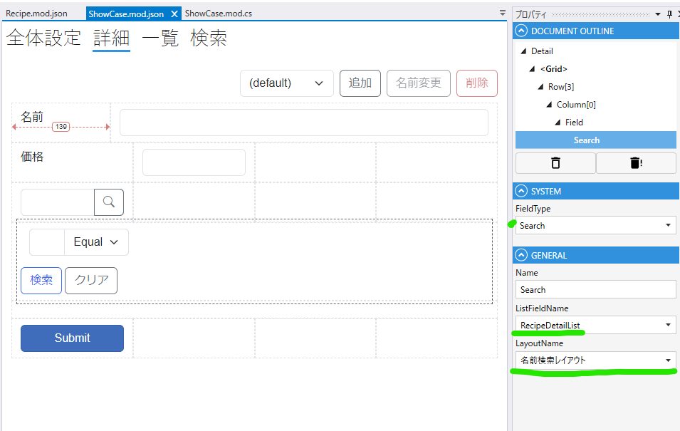
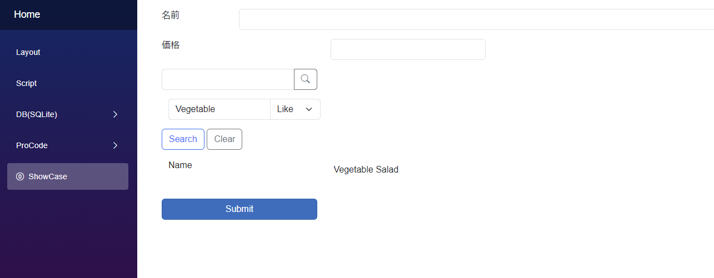

# モジュール検索設定

## ツールボックス
モジュールで使用するFieldを選択します．

| 項目           | 説明                                               |
|--------------|--------------------------------------------------|
| SystemFields | SystemFieldの一覧が表示されます                            |
| CustomFields | CustomFieldの一覧が表示されます                            |
| DB Fields    | 全体設定でDataSourceを指定した場合に，テーブルのカラムからField候補が表示されます |
| Rest Fields  | DB Fieldsで詳細設定で（まだ）使用していないFieldが表示されます．          |
| Link Fields  |                                                  |
| Layout       | 詳細画面でGridレイアウト，Canvasレイアウトを設定時に使用します．            |

## 検索設定
列，段の数を指定して一覧表示の設定をします．

## 4. プロパティ
選択しているFieldのプロパティが表示されます

### 複数レイアウト
ModuleFieldをSelectFieldで検索する場合，あらかじめ作成した複数のレイアウトから選択できます．
- デフォルトレイアウトの例
  
  
  

- レイアウトを指定した例
  
  
  

