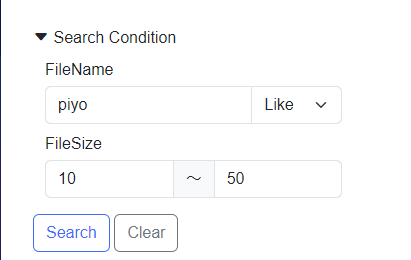

# File

## SearchFileSizeMin `property`
ファイルの検索条件の最小サイズ

## SearchFileSizeMax `property`
ファイルの検索条件の最小サイズ

## SearchFileName `property`
ファイル名

## FileNameComparison `property`
ファイル名の条件区分

```csharp
void SearchLayoutDesign_OnInitializeSearch()
{
  File.SearchFileName = "piyo";
  File.SearchFileSizeMax = 50;
  File.SearchFileSizeMin = 10;
  File.FileNameComparison = MatchComparison.Like;
}
```



## FileName `property`
- ファイル名
- `get`のみ
 
```csharp
File.FileName;
```

