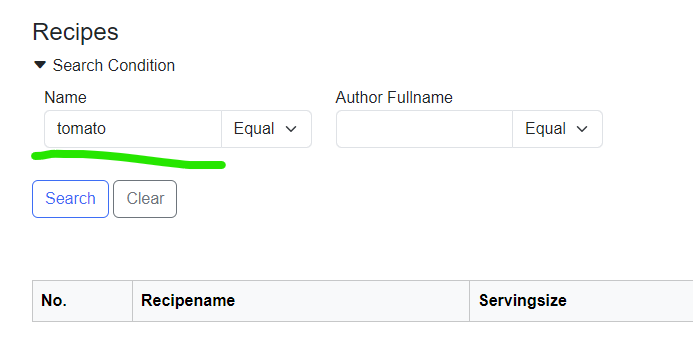

# TextField 

## SearchValue `property`

一覧の検索条件のinputフィールドのvalue

例
```csharp
void SearchLayoutDesign_OnInitializeSearch()
{
    Recipename.SearchValue = "tomato";
}
```




## Comparison `property`

一覧の検索条件の条件区分
- Equal
- NotEqual
- LessThan
- LessThanOrEqual
- GreaterThan
- GreaterThanOrEqual
- Like


