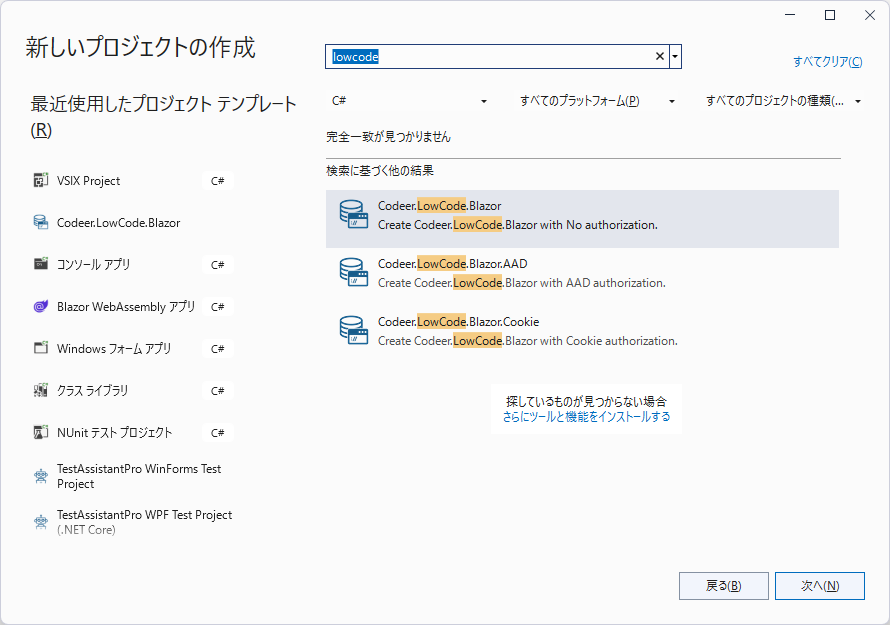
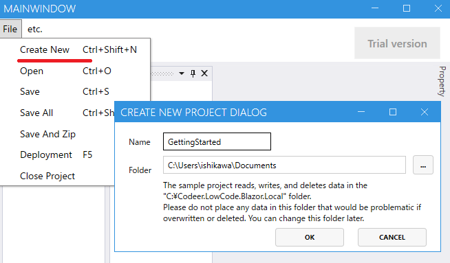

# Codeer.LowCode.Blazor (Alpha)

## Features ...
Codeer.LowCode.Blazor is a framework to transform your web app into a no/low-code application. Quickly create the majority of features with no/low-code, and craft specific features with pro-code as you would in a full-stack development. As a result, you can create satisfying apps within a short delivery time and at a low cost.

## Getting Started
You can create projects using Visual Studio extensions. However, it is still being prepared. Please wait a while. I have prepared a sample project instead. Please try using that.
Please follow the respective licenses for the Nuget packages you are referencing.

[Getting Started Templates](Template/GettingStarted)

### Step1
Build and launch the designer and web app.

### Step2
Create a new project in designer.
A project containing the sample will be created.

### Step3
Deploy it to a web app. The screen will be hot reloaded and the screen will be displayed according to the designer settings.

### Step4
Get a feel for it by looking at the designer settings, making small changes, and sending it to the web app. Details will be added soon.

## Recommended for Projects That

- Want to save on cost and time
- Want to effectively utilize RDB
- Want to leverage existing data and systems
- Have specific features in mind
- Desire customization after release

## Create Screens with Ease

Create screens freely with a combination of grid layout and FlowLayout. It's possible to create not just regular screens but also dialogs. Interaction between UI components can be achieved with no-code or minimal scripting. Essential elements like sidebar, header, and footer are provided, and those with specific preferences can customize with pro-code.

## Seamless RDB Integration

Associate forms and DB tables for input and output of data. Linking multiple forms allows representation of Join or 1N relationships. Forms can also be linked to Views, enabling easy implementation of BI functions. Common database operations such as logical deletion, optimistic locking, and tracking of creation/update information are included. Change history can also be maintained.

## More Freedom with Scripts

Write in syntax nearly identical to C#. The API design allows for implementation of features with minimal coding. Code completion makes implementation easy, and customized functions can be called with pro-code. Execution is primarily on the client-side, but server-side execution is also supported.

- General computational operations
- Screen controls
- Execution of WebAPI/stored procedures
- Editing Excel/PDF creation

## Excel Integration Support

Supports not only general data input/output but also allows for creating templates in Excel and modifying them for report generation. Conversion to PDF is also possible.

## Authentication & Authorization

Provide generic cookie authentication or default authentication using Azure Active Directory in your template code. Other authentication methods can also be customized. Authorization allows for access control at the application, screen, and data levels.

## Implement Specific Features with Pro-Code

In some cases, special screens/features are necessary. As Codeer.LowCode.Blazor is a Blazor library, .NET code can be added for such implementations. Moreover, creating components allows for their use in various places.
